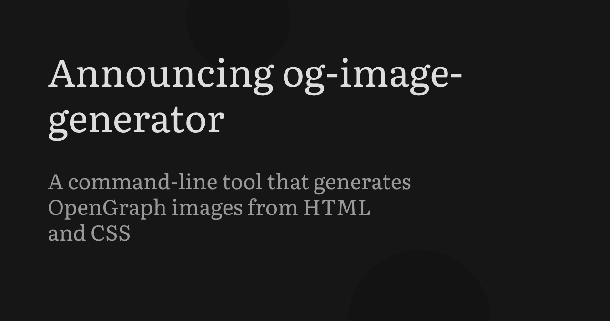
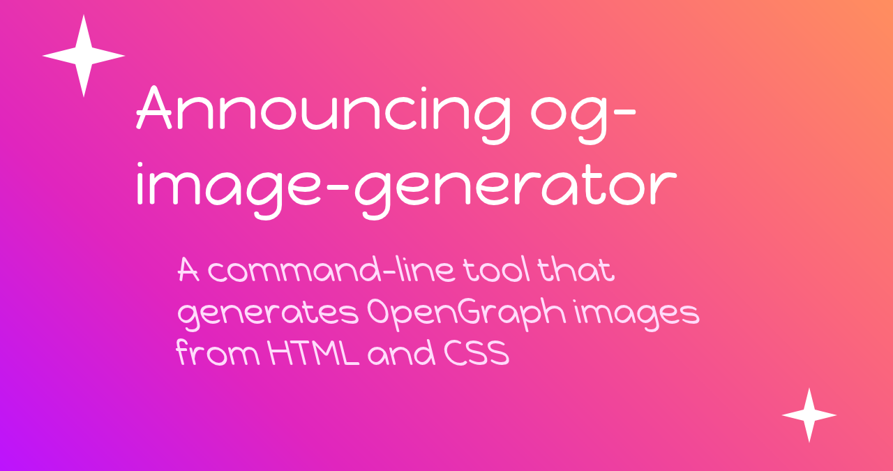

# og-image-generator

This project lets you easily generate beautiful Open Graph images for your blog using **HTML and CSS**!

It is distributed as **a single binary** and uses [blitz](https://github.com/DioxusLabs/blitz) to render HTML and CSS to an image, making it significantly more lightweight than something like a Headless Chromium wrapper.

## Examples

Examples of generated open graph images

### Carbon

Source file: [carbon.html](./examples/carbon.html)

```sh
og-image-generator examples/carbon.html title="Announcing og-image-generator" description="A command-line tool that generates OpenGraph images from HTML and CSS" --font examples/Literata.ttf
```

Output:

</img>

### Party Time

Source file: [partytime.html](./examples/partytime.html)

```sh
og-image-generator examples/partytime.html title="Announcing og-image-generator" description="A command-line tool that generates OpenGraph images from HTML and CSS" --font examples/HappyMonkey.ttf
```

Output:

</img>

## Installation

### Homebrew

```sh
brew install nik-rev/tap/og-image-generator
```

### PowerShell

```sh
powershell -ExecutionPolicy Bypass -c "irm https://github.com/nik-rev/og-image-generator/releases/latest/download/og-image-generator-installer.ps1 | iex"
```

### Shell

```sh
curl --proto '=https' --tlsv1.2 -LsSf https://github.com/nik-rev/og-image-generator/releases/latest/download/og-image-generator-installer.sh | sh
```

### Nix

We have a `flake.nix`, so you can build from source with `cargo build`
